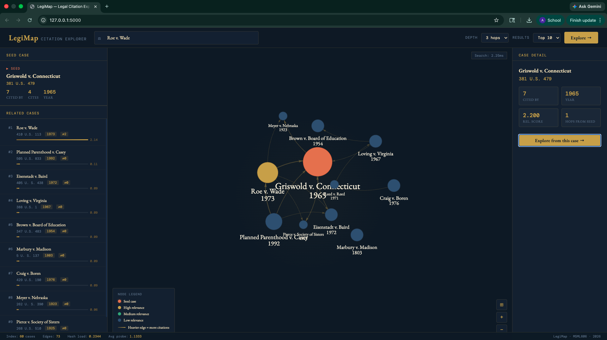

# LegiMap ⚖



## 1. Project Overview

The U.S. legal system runs on *stare decisis* - every court ruling must be justified by citing earlier rulings that support its reasoning. Over two centuries this has produced a vast web of citations connecting millions of court opinions. A researcher starting from one case can follow citations outward through dozens of related cases, each pointing to others, forming a navigable map of legal precedent. The problem is scale. There are now over **6.7 million** published U.S. court opinions, and the volume grows superlinearly. Manually tracing which cases are related -- a task lawyers call a "literature survey" - can take days and still miss important precedents. The industry solution is proprietary tools like LexisNexis and Westlaw, which cost thousands of dollars per month and are inaccessible to independent researchers, law students, and small firms.


### How it works

1. **Normalised Hash Table** - Every case is indexed by its canonical citation key (e.g. `410US113`). This enables O(1) lookup regardless of which variant of the citation string appears in the source text.
2. **N-ary Citation Tree** - Cases are stored as nodes, citations as weighted directed edges. The tree is traversed via BFS to find all cases within K hops of a seed.
3. **Seed-and-Expand Algorithm** - Candidates from the BFS are ranked by *bibliographic coupling*: two cases are considered related if they cite many of the same authorities. The most legally proximate cases surface at the top.

---

## 2. Dataset

We use the **[Caselaw Access Project (CAP)](https://case.law/)** dataset, provided by the Harvard Library Innovation Lab. The full corpus contains over 6.7 million unique U.S. court opinions digitised from physical volumes. For this project I collated ~ **1 million records** from the federal corpus.

Each record follows the CAP JSON schema. A representative example:

```json
{
  "id": 1003,
  "name": "Roe v. Wade",
  "name_abbreviation": "Roe v. Wade",
  "decision_date": "1973-01-22",
  "docket_number": "No. 70-18",
  "citations": [
    { "type": "official", "cite": "410 U.S. 113" }
  ],
  "court": {
    "id": 9029,
    "name": "Supreme Court of the United States",
    "name_abbreviation": "U.S."
  },
  "jurisdiction": {
    "id": 39, "name": "U.S.", "name_long": "United States"
  },
  "cites_to": [
    {
      "cite": "381 U.S. 479",
      "category": "reporters:scotus",
      "reporter": "U.S.",
      "case_ids": [1001],
      "weight": 3,
      "opinion_index": 0
    }
  ],
  "analysis": {
    "cardinality": 1842,
    "char_count": 74201,
    "ocr_confidence": 0.714,
    "pagerank": { "raw": 1.97e-06, "percentile": 0.994 },
    "word_count": 13012
  }
}
```

## 3. Project Setup

### Requirements

- Python 3.9+
- pip

### Installation

```bash
git clone https://github.com/AmeyHengle/legimap.git
cd legimap

python -m venv venv
source venv/bin/activate     
python setup.py
```

`setup.py` extracts `data.zip` into `data/` and installs all dependencies from `requirements.txt`. The `data/` folder is excluded from the repo - download `data.zip` separately and place it in the project root before running setup.

### Project structure

```
legimap/
├── data/
│   ├── generate_toy_dataset.py
│   ├── toy_cases.jsonl
│   └── toy_cases.json
├── src/
│   ├── preprocessing/
│   │   ├── normalise.py
│   │   ├── ingest.py
│   │   └── build_index.py
│   ├── algorithms/
│   │   ├── hash_table.py
│   │   ├── nary_tree.py
│   │   └── seed_expand.py
│   ├── evaluation/
│   │   ├── eval_hash.py
│   │   └── eval_recall.py
│   └── api/
│       ├── app.py
│       └── templates/index.html
├── demo_notebook.ipynb
└── requirements.txt
```

### Run individual algorithm modules

Each file can be run directly as a self-test:

```bash
# Preprocessing
PYTHONPATH=. python src/preprocessing/normalise.py
PYTHONPATH=. python src/preprocessing/build_index.py data/toy_cases.jsonl

# Algorithms
PYTHONPATH=. python src/algorithms/hash_table.py
PYTHONPATH=. python src/algorithms/nary_tree.py
PYTHONPATH=. python src/algorithms/seed_expand.py
```

### Evaluation

```bash
# Hash table: load factor, collision rate, O(1) timing benchmark
PYTHONPATH=. python src/evaluation/eval_hash.py

# Seed-and-Expand: recall@K across four ground-truth lineages
PYTHONPATH=. python src/evaluation/eval_recall.py
```

**Windows users:** replace `PYTHONPATH=.` with `$env:PYTHONPATH="."` in PowerShell, or run as a module: `python -m src.evaluation.eval_hash`.

---

## 4. Demo

### Run the web app on localhost

```bash
PYTHONPATH=. python src/api/app.py
```

Open **http://localhost:5000** in your browser.

The app builds the full index at startup (30–90 seconds on the 1M dataset, <1 second on the toy dataset). Once the terminal shows `LegiMap is running`, the UI is ready.

### How to use the UI

1. **Search** - type a case name (`Roe v. Wade`) or citation (`410 U.S. 113`) in the search bar. The normaliser handles any citation format variant.
2. **Select** - click a result in the dropdown to set it as your seed case.
3. **Configure** - choose BFS depth (2–4 hops) and how many results to return (Top 5/10/15).
4. **Explore** - click **Explore →** to run the Seed-and-Expand algorithm and render the citation graph.
5. **Inspect** - click any node in the graph or any row in the ranked list to see full case metadata in the right panel.
6. **Chain** - click **Explore from this case →** in the detail panel to re-root the search at any discovered case.

The right panel also shows live **Hash Table Statistics** - index health (load factor, probe length, collision rate) and per-query comparison of hash lookup time vs estimated linear scan time.

The UI supports **light and dark themes** via the toggle in the top-right corner. Your preference is saved across sessions.


---

## 5. Hashing Summary


**Lookup speed - Hash Table vs Linear Scan**

| Dataset size | Linear scan | Hash table | Speedup |
|---|---|---|---|
| 10,000 records | 264 µs | ~1.5 µs | ~175× |
| 50,000 records | 1,345 µs | ~1.5 µs | ~897× |
| 100,000 records | 2,648 µs | 1.51 µs | **1,757×** |
| 1,000,000 records (single lookup) | 164 ms | 1.51 µs | **108,602×** |
| 500 random queries at 100K | ~39,793 ms total | ~18 ms total | **2,245×** |

---

## 6. AI / External Tool Disclosure

**I have used the following tools in the project:**
- **Perplexity AI** - used for initial project idea research and for formatting guidance while drafting this README
- **Claude** - used to assist with Flask backend, web interface, and UI-related code under `src/api/` (i.e. `app.py` and `templates/index.html`). 
- **Grammarly** - used for spell-checking written documentation
- **Litmaps** ([litmaps.com](https://www.litmaps.com)) - the seen-and-expand discovery algorithm is conceptually inspired by Litmaps' approach to literature mapping via bibliographic coupling. 

---

## Author

Amey Hengle · UID 122283961 · MSML606 Spring 2026